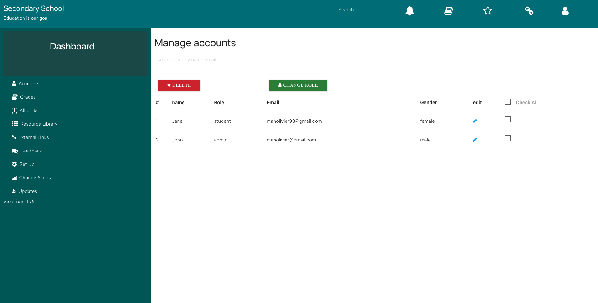

## Users

All users who create accounts with your SparkEd program will be listed here, with `privileges` identified by level (see below). This helps the `Administrator` to manage all users, including `name changes`, `approval` and `deletion of accounts`, `management of all roles`. 

The `Search bar` allows the administrator to easily identify registered users by name or email.
User privileges can be assigned by the Administrator.  

## Role Definitions and Privileges  

`Administrator` : has control over complete system and allows for activity and approval and editing of all privileges at other levels.  More than one administrator is allowed.  Administrator is the only user level where User Authentication can be changed (see below) and only Administrator can assign users new roles.  

`Content Manager` : allows for adding and editing of contents. 

`User`: allows for viewing of uploaded content but not editing or altering anything else in the system

 
<!-- Temporary removed this screenshot -->

<!--    -->

<!-- An image will be later added here for ManageAccounts Page -->

