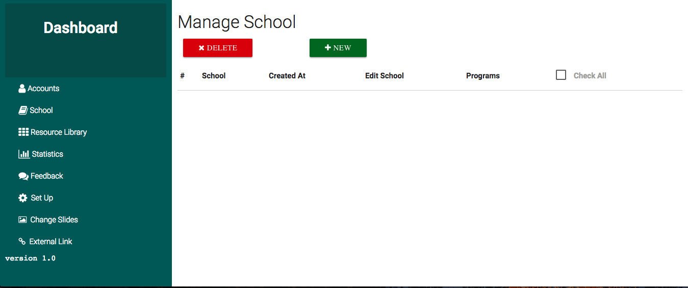
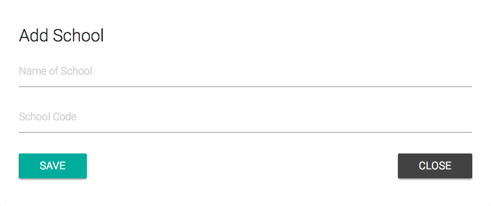
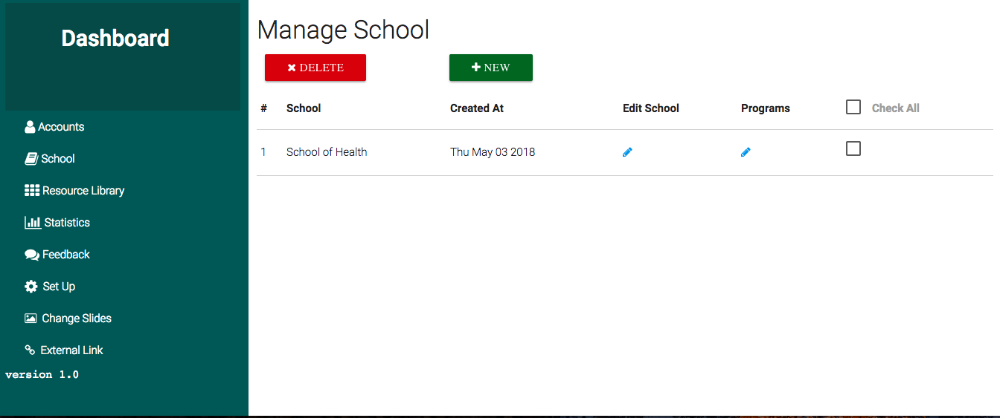
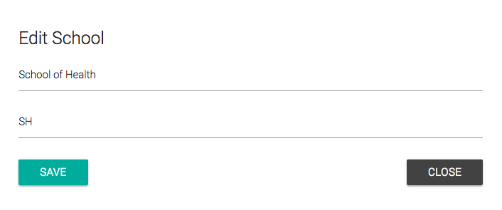
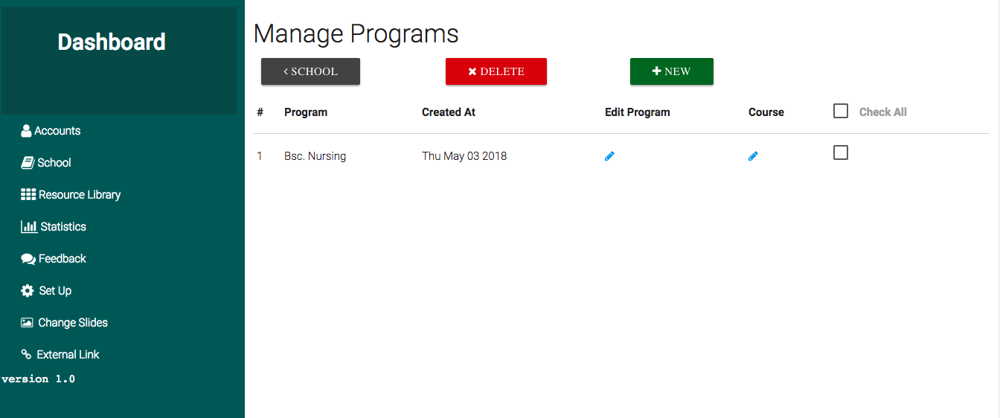
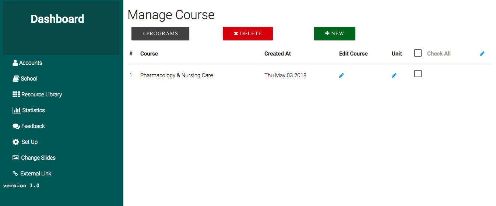
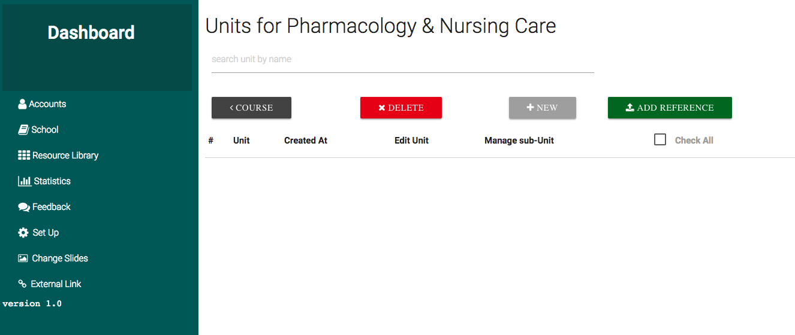
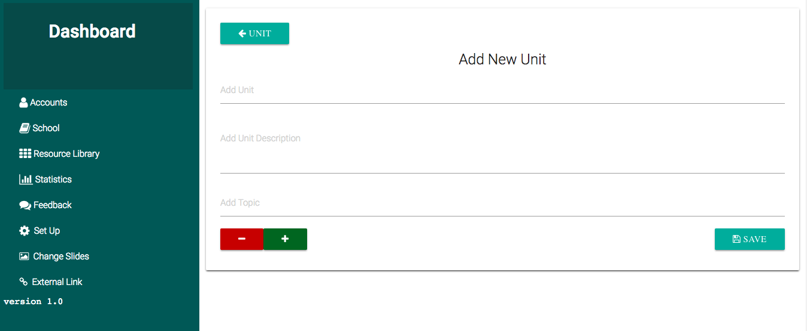
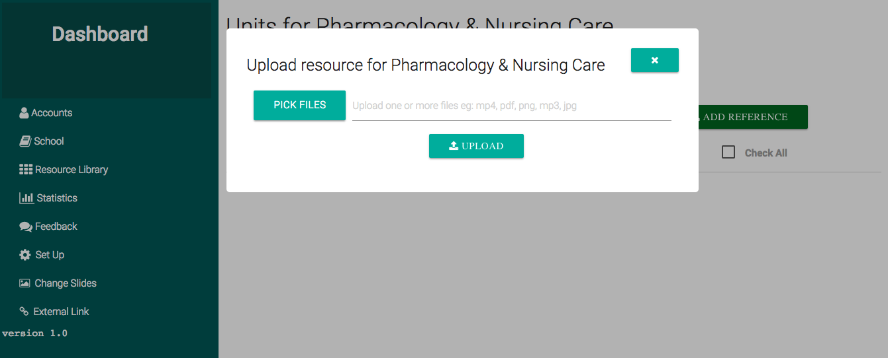

## School

As Explained in the previous page, The school structure is designed for large institution, This guide shows you the important things to know when managing schools' contents. 

We assume School Structure was choosen during setup but the same management applies when the structure is [course based](setup.md#course) or it is for [high school](setup.md#high-school) , Starting from the [unit level](#course-units), you should be able to follow the same instruction despite the structure that you would have choosen when setting up.  

  

The above page is for the `dashboard` and it is called school management, here you can `add` different schools, `delete` schools and  `edit` schools.  
### Add School
The New button next to delete allows the Administrator to add a new school, when clicked it brings a simple form to add `Name of School`, ` School Code` as shown in the picture below.  
Note: School Page is **high level** and only accessible to `Super Admin`, Content-managers don't have access to this page. 

  

School Code can be anything, to identify from different Schools  
When You are done Entering the above 2 fields you click on Save button to add the new school  

### Listing Schools

After Saving, You will get a quick notification that the school was successfully added, and it will be listed as shown in the picture below.  

  

> `School` is the name of the School  
> `CreatedAt` is the date on which that school was created  
> `Edit School` When the pencil that shows on each listed school is clicked it pops out a form to update details for that school, this is useful in case the school name has been changed or the Administrator made a mistake when creating that school. as shown in the picture below.    
> `Programs` This is the links that takes you to the next page to add programs that are under that school.  
> `Delete` The delete button allows the Administrator to delete the checked(Selected) School. Note: An administrator can only delete the contents they created to avoid messing up with other content-managers' contents. Make sure you know what you are doing when deleting contents as there is no other option of returning the deleted contents.  

### Editing School  

  

Just like when Adding School, when you are done editing school details, you click the save button to update the edits, and you will have new changes saved.   

## Programs 

Adding a program under a school is basically the same procedure as adding a school, the administrator however should keep in mind that the program falls under the selected school, below is the page that shows programs, Managing (`Adding`, `Editing` and `Removing`) is the same as for School  

There is slight difference when adding a program, there is `program duration`, this is how long does the program lasts, like e.g: Nursing can take 4years(Most programs do);
Under Programs page, you have a button to take you back to Schools anytime you want to.  

  

## Courses 

Courses are arranged in the same way programs are, Administrators and Content-Managers can add and modify courses, a point to note on adding or editing courses is that there is course year field, this is can be like 1st year or 2nd(eg: 1 or 2), for procedure on `adding`, `editing` and `deleting` please refer to this [link](#school) as the same applies to both.  

  

## Course Units  

The course units belong to the selected course, on this page the name of the course is shown on top of the page and since course units might be many we provide a search box to search through a couple of that course's unit.  
There are 2 new buttons on this page, the `new` and `add reference`.  
 
 

### Adding Units

`new` Button unlike on [Courses](#courses) or [Programs](#programs), it opens a new page.

From the new page, you can add a `unit`, the `description` of that course and topics that belong to that course unit, there is two buttons the `red(-)` and the `green(+)`, these two will help you add or remove topic fields, this is case you want to add more than one topic at this level.  
When you are done, you can click save to add the course unit with its topics, you can make use of the back button on top written `units`, it takes you to the list of course units.  

When a new unit is added, if User Authentication is enabled then users will be notified that there is new contents that has been added.  

  

### Add Reference  

Back to the list of units, another button `add reference` allows `content-managers` to add resources that are under that course but don't necessary fall under any specific course unit or topic.  
When the button is clicked, it will pop out a form to upload resources with the title of the current course.  
You can upload multiple files with different file formats, the supported files are `images`, `pdf`, `audio`, `mp4`, `webm`.  

The files may take a while to upload, this will depend on your server setup, the upload progress will be shown, once the upload is done you will be notified quickly and a link of where the uploaded files are listed will be provided, if you want you can follow it or you can continue with managing course units.  

**Note**: ***The Uploaded files are not listed on course units page, they can be found in [Reference Library](referencelibrary.md)***

  

### Searching Course Units  

In case you are looking to edit a specific course unit, you can type the name of the course unit in the provided search box and press enter to see the matching results.  

## Topics  

The Topics page exist under the school and course structure, it comes immediately after course units and the resources are uploaded under a specific topic.  

> To be added `Image for Topics Page`

Topics can be managed(`Added`, `Edited` and `Deleted`) the same way as other contents in SparkEd  
If it happens to be that topics listed are more than 10, the topics will be paginated, 10 is the default number of topics displayed on the per page, this can be changed in the top right corner of the page.  

## Resources  

The Resources Page is one of the most important pages, Management is the same as other pages, the only difference is that it allows you to upload resources for the previously added contents in this case, we are addding resources under the previous topic.  

> Resources to be added can be in different file formats, currently the supported files are `images`, `videos(mp4 and webm)`, `books(pdf)` and `audio(mp3)`.   
The current size limit is 5GB but we would recommend to keep your files small to about `250mb` as the maximum per file however you are not limited.  

The Upload will show you how many files you have selected to upload and how big they are.  

Just like on the [Add Reference](#add-reference) and [Uploading logo](setup.md#upload-institution-logo) the upload shows progress in percentage and a progress bar to let you know how far files are when uploading.  

 

<!-- Screenshot for the School Management Component -->