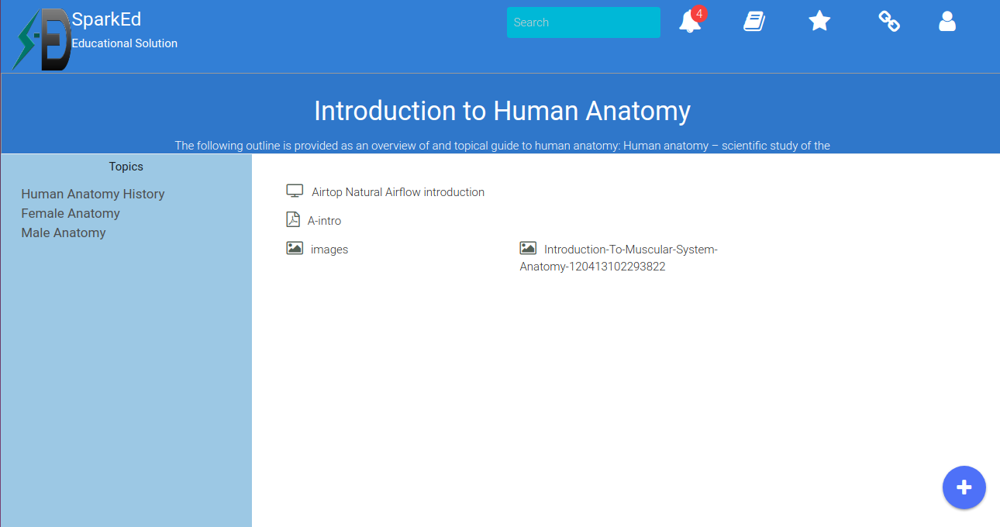

## Topics and Resources  

This is meant to be the lowest level of any content added to the SparkEd, the page list on the side all topics under the selected course unit from previous page, this can defer depending on the platform that was choosen by the Administrator.  
In case the topics are more than 10 they will be paginated, each active(Clicked on) Topic will display the resources that are under it, the resources are categorized according to their types, this helps users quickly find the resource they are looking for without necessary doing a search.  

The screenshot below shows the topics page 

  

> Note: This page also shows the description on the previously selected course unit, in case this was added by the content-manager.  

