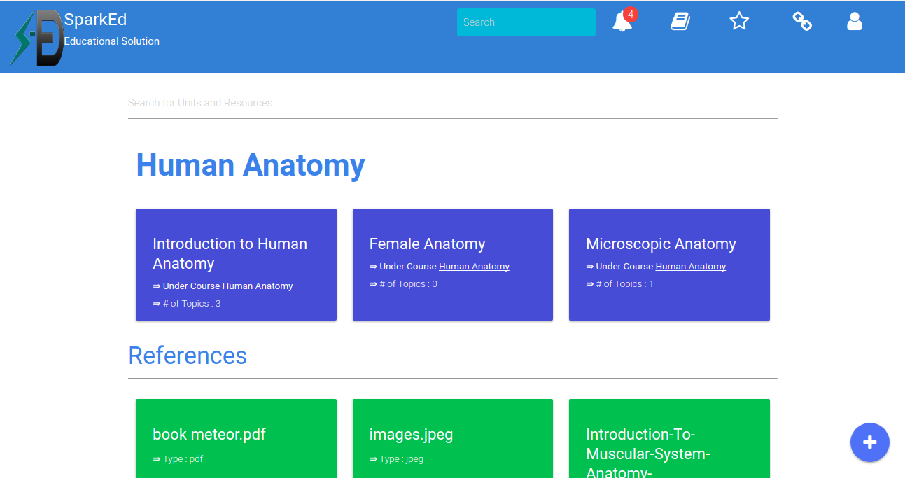

## Courses Content  

The content page is available in all modes except High School mode, it lists all the course contents, these include course units and their references in case they were added. 
The search on top is basically the same as the one provided in the header.  

  

The Course units are displayed on top of the page while the references are shown at the bottom of the page.  

