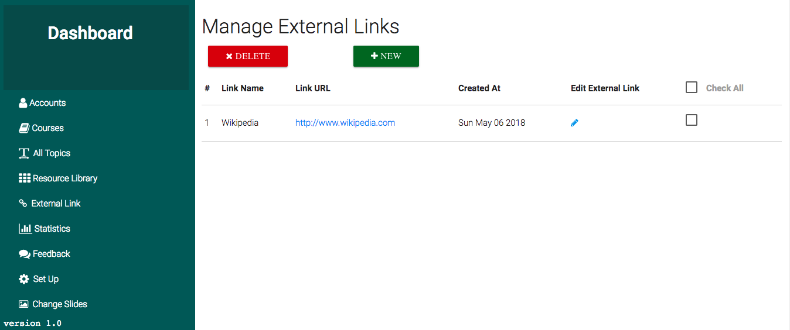

This is the page where Administrators and Content-Managers can see add external links, these can be internet websites that can be used as references by students, they can also be offline websited that are kept on the server for easy access, like wikipedia, khan-academy and many more etc ...  
Just like other pages from here, the links can be either `deleted`, `edited` or `added`.  
The screenshot below shows the external links page.    

  

As of now the external links are not indexed for search but this feature will be added soon.  
