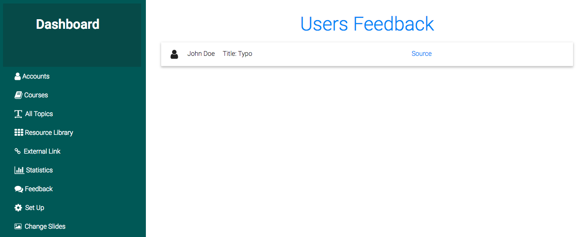
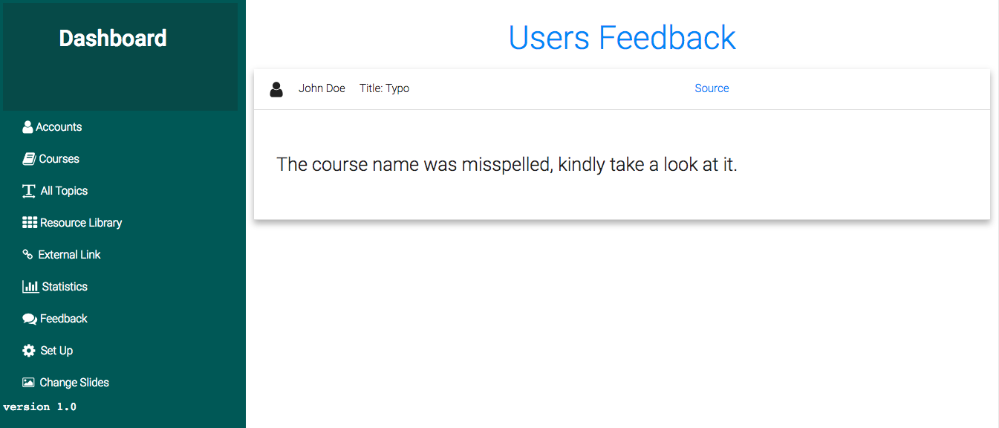

## User Feedback  

Users can at anytime send a feedback to the admin from different pages, If the User Authentication is disabled users will still be able to send their feedbacks as `anonymous`.  

In this case the Admin will not be able to identify who has sent the feedback but everyfeedback is sent with the `origin page`(The page where it was authored) this helps the Admin to easily go to that page in case there is a problem that needs to be fixed from there, it can be `a wrong resource`, it can be a `misspelling` or any other thing that users would have reported to the Admin.  

Feedback initially will just list showing the sender, title and the origin link but when clicked they can be expanded to show more information to the admin this include the feedback itself.  

This is shown in the following screenshots.  

  

## Expanded  

And when expanded to read more details  

  

