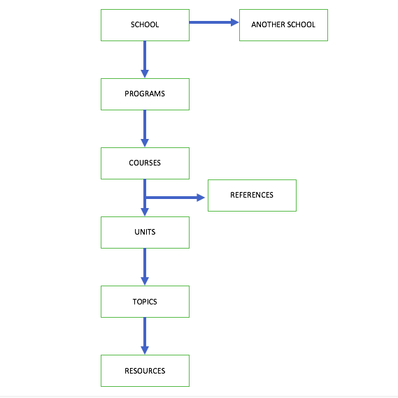

## Choice of Framework  

The software program was designed to accommodate a few different frameworks for organizing your content for your building your resource.  

**Important Note**: Once the initial framework is chosen and you begin building your resource you cannot go back and change which framework you are working in,   
Some features of each are given below.  

### School/Organization  

This is designed to have a few organizational levels prior to the addition of content.  The overall organization here somewhat assumes that dissemination will be from a central resource/server with student accessing via wi-fi with capability to download as needed or desired.   As an example, if a higher education or vocational school were using this, they could list programs (or even schools), then add years/semesters/terms, then add courses then add content.  If this were an NGO/organization with multiple types of educational programs such as Agriculture, Health, Financing, etc. they each could be listed and then the next layer would have courses/content.  Alternatively, each of these types of programs/schools/ could each have their own resource developed if they were going to be disseminated separately.   

**NOTE**: For higher education institutions thinking of extensive listing of courses and resources and a desire for testing, discussions, etc. we recommend a Course Management System such as Moodle. 

 

### Courses/Programs  

This is designed to accommodate the desire to organize and deliver a single or small number of educational programs with a smaller number of end users.  Once designed, the resource could be moved to devices or accessed from small scale content based access devices.  

  

###  High School  

This is more likely to be a national program as we did in Ethiopia and so organized by grade and courses with textbook and resource digitization.  Could also just be complimentary resource organization using courses/modules as organizing structure.  

 

## Institutional Logo  

Institutional logos or banners may be added as part of the customization
Recommended size of logo upload is less than 140X100 in resolution and less than 150kb.  The recommended logo format is png with a transparent background.

  

Once the Upload is done successfully, You will be taken to the Main [DashBoard Page](accounts.md)     

