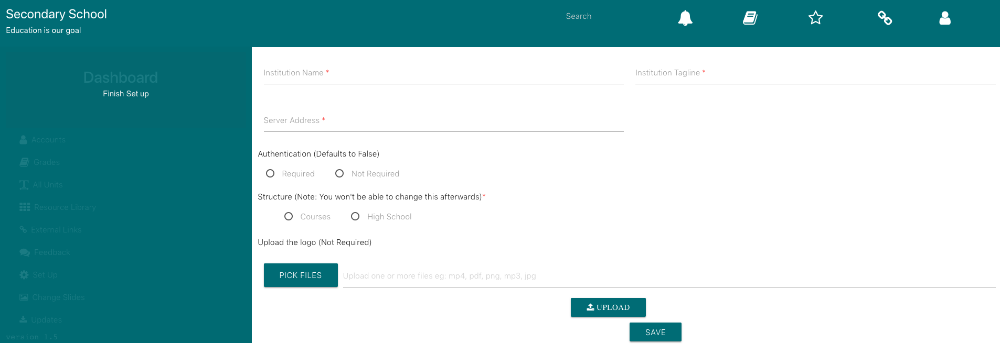

## System Requirements  

The SparkEd software was developed on Ubuntu 16.04LTS backbone and thus Ubuntu 16.04LTS or greater is recommended for initial set up, The installation can also run on windows server but our recommendation is running it on Ubuntu, if you are going to run it on a windows server  You can check [our github wiki](https://github.com/SparkEdUAB/SparkEd/wiki) for more information.  

## Overview  

You will be taken through the steps to set up what we consider a production “server” the size of which will vary depending on the size and scope of your project and how many developers will be involved.  This will be where you establish the structure and content for your school or educational program.  The full content will be on this production server and could be replicated onto distribution servers, mobile devices, or whatever dissemination system you desire but ultimately this is designed to produce content to be delivered in offline formats.    
  
## Initial Administrator Set Up  

a)	Follow the guide [here](https://github.com/SparkEdUAB/SparkEd/wiki) to get the SparkEd running on your server.   
b)	An initial window will open (pictured below) the registration of the initial Administrator (see below for definitions).  
c) Register to setup the platform as an administrator  

  

##  Key Initial Decisions  

### Overview
You will be prompted to establish.  
1) name your system/school/program/institution and have the option of adding a tagline or motto which will appear on your opening page;  
2) whether you will require all end users to log in or not.  
3) which broad framework for developing your resource you wish to use.(Defaults to High School)    
4) Upload the logo of your system/school/program. (This is very optional)   
The screenshot of the window for these decisions is below. 

  

### Institution/Program Name  

This will be totally dependent on what resource you intend to develop and can be edited at any time.  This can also be a logo.   Similarly you can add whatever you wish as a tagline.  

### User Authentication   

The system allows for requiring User registration and log in or allowing the use of the platform at the user level without login.  Requiring log in would allow collection of individual user usage data vs just site “hit” usage data. Enabling User Authentication would require administrative approval of each enrolled user and so adds an administrative burden. This selection is made by `enabling` or `disabling` the User Authentication at set up. `default is Disabled`. 

