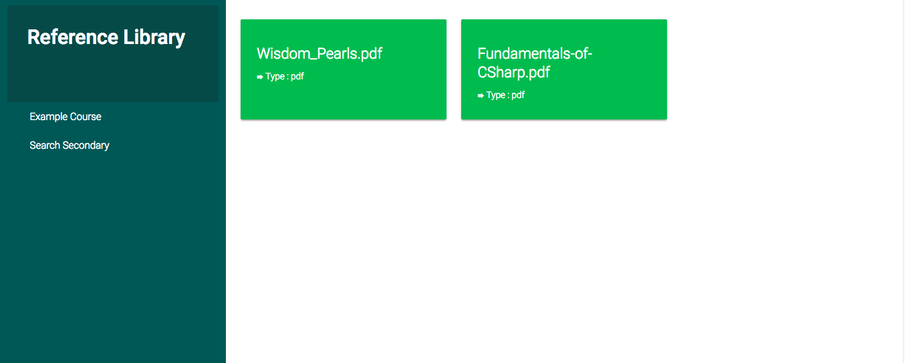
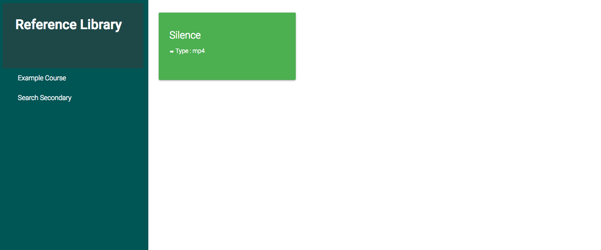
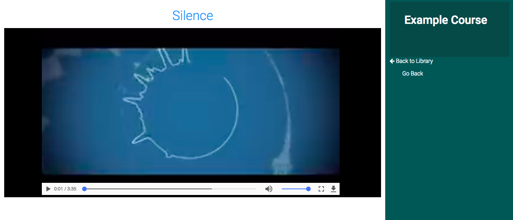

## End-User References  

This page contains references that were [added from reference library](referencelibrary.md) or [from unit level](contents.md#add-reference) of either `courses` or `subjects` by administrators or content-managers.  

These resources are easily accessible by the user, when the page is first visited the resources that are listed are the anonymous ones(the ones that don't belong to any course or subject).  
The reference resources are displayed in form of green cards with the name of the reference and the type(file format of the reference).
The below screenshot shows the reference page 

 

## Course or Subject Based Reference  

The Reference Page also list aside all courses or subjects that have been added by the Administrators, these helps the users access the **references materials** that only belong to a specific course or subject.  

If it happens to be that the courses or subjects are more than 10, they will be paginated and the user can click on any desired page to get a specific course or subject.  

When a course or a subject is clicked, the page will only list the references that fall under the specified course or subject.  

  

Note: `Once a reference resource is added by a content manager or admin, it will be available for search, in this case users can user the search box provided in the header to look for the desired reference.`

## Viewing References  

When a user clicks on a reference depending on what type of a file it is, the file will be opened in a new page, the resource will be opened immediately.  
This page will display the name of the selected reference, the course or subject it falls under, if none there it will just be an anonymous reference.  

  

 

