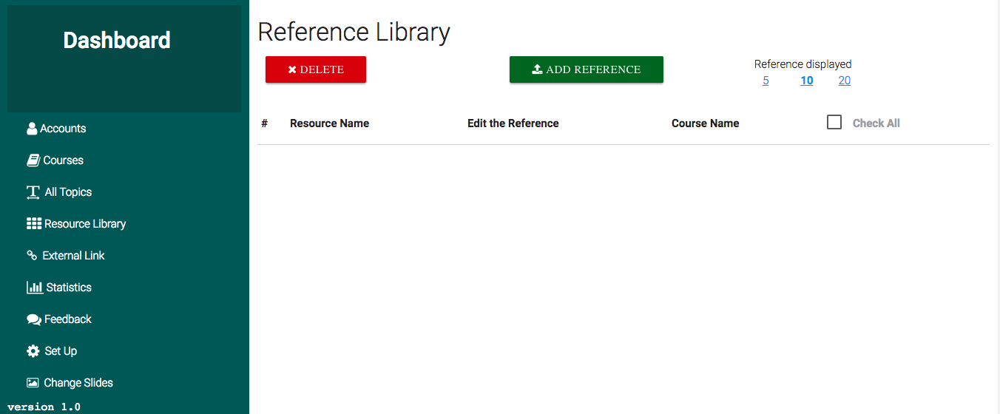
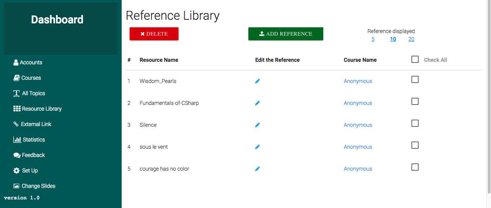
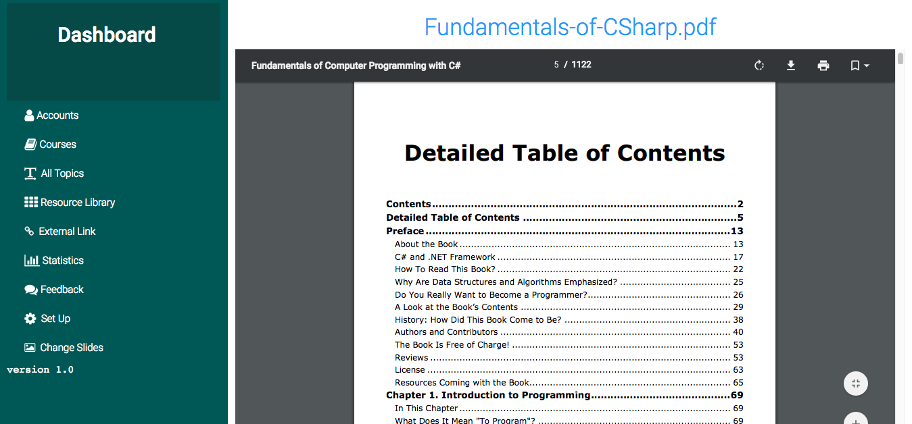

## Reference Library

This is a page that displays all resources that have been uploaded and do not belong to any course unit or subject unit, these can fall under a `course` or a `subject` like the ones [uploaded from here](contents.md#add-reference) or can be `independent`.  

This is good for materials that are not related to any listed topic but content-managers might want to add these resources as part of the curriculum and students will be able to access the uploaded resources.  
Content-Managers can from this page upload the resource of the supported file formats as mentioned in [Adding Resource](contents.md#resources).  

  

`Content-Managers` and `Administrators` can click on each listed resource to `quickly preview` what kind of the resource it is, From here They can also either delete or modify the listed resources.  
By default the page displays 10 resources but this can be changed from the top right corner, the numbers range from 5 to 20 per page, the rest will be paginated to other pages. 
This applies to other pages that have pagination on them.  

## Viewing the reference  

The Screen below shows the list of the references that have been uploaded.   

  

Administrators and Content-Managers can click on any upload reference material to quickly preview it, the screeshot below shows the preview of the uploaded reference.  

  

As the above picture shows, the Admin or content-manager is still in the Dashboard, it's a convenient way for content-managers to view the uploaded files without going through the end-users pages.  
 

