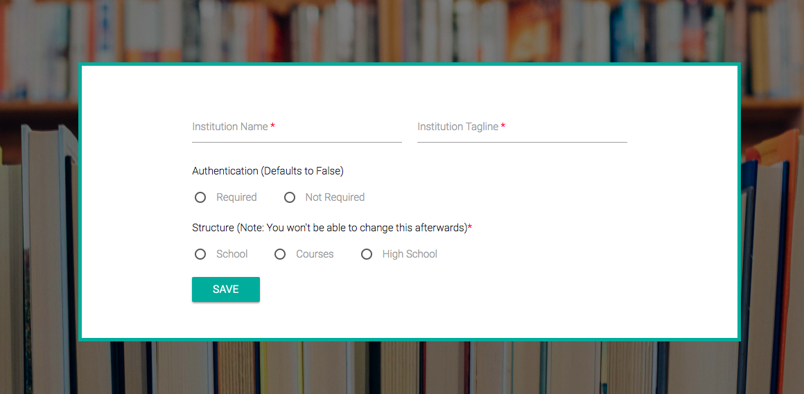
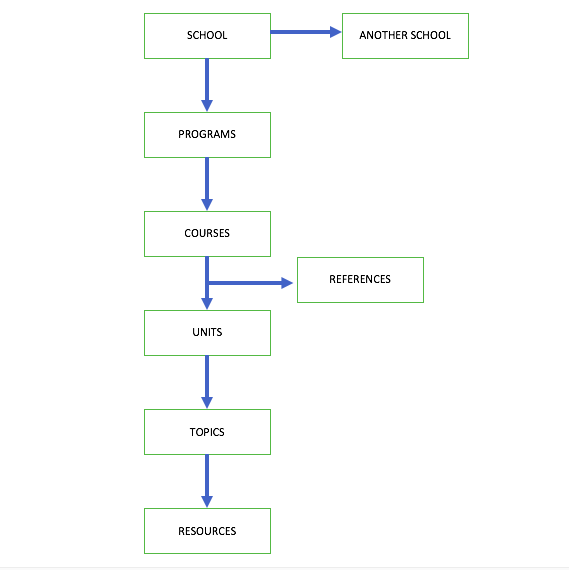
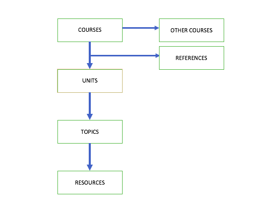
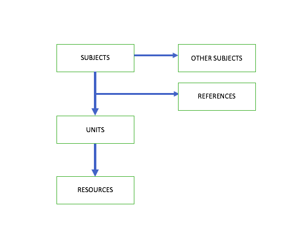

## Setting  Sparked

Setting up SparkEd is an important step, The administrator is asked to enter the institution details after a successfull installation of the platform and after creating the first account as an administrator. 

As the screenshot below shows, the form has different fields 

<!-- The screenshot should be here -->

  

## Institution Details 

> The `Institution name` is as it says, `The Tagline` can be the tagline or the motto for the institution.   
> [`Authentication`](users.md#introduction) This allows the administrator to choose whether the platform should require users to have accounts before accessing contents, if this is false, users will be able to access contents without [logging-in](accounts.md), however the administrator will still be required to [login](users.md#login), 
If it is set to true then users will be required to [create accounts](users.md#register) and login before accessing the contents.  

## Structure 

SparkEd Structure is a very important to note, This changes dynamically depending on the selected options. The following are the available structure options:  

- `School`  
- `Course`  
- `High School ` 

Once the setup is done and the structure has been chooses, it can not be changed, so take note when you are saving the configurations of SparkEd.

### School  

When School is choosen as a structure option, SparkEd Contents will be arranged as a wide institution with different schools, This can be compared to a University with different schools eg: School of Health, School of Engineering, School of Natural Sciences, etc...  
All these can be added and managed with their separate contents when the Structure is School Based.
So in short the School structure is for Universities.  

### Course  

The Course Structure is designed to be an easy way for small institutions like Colleges to manage their contents, Administrators can add different courses with their course units and any other resources.  

  

### High School 

The High School Structure is meant for lower level schools, because the structure levels are few, Managing High School Contents is as easy adding subjects, their units and the resources under those units.  

  

When you are done entering all the required fields, click the save button and you will be asked to upload the logo.

