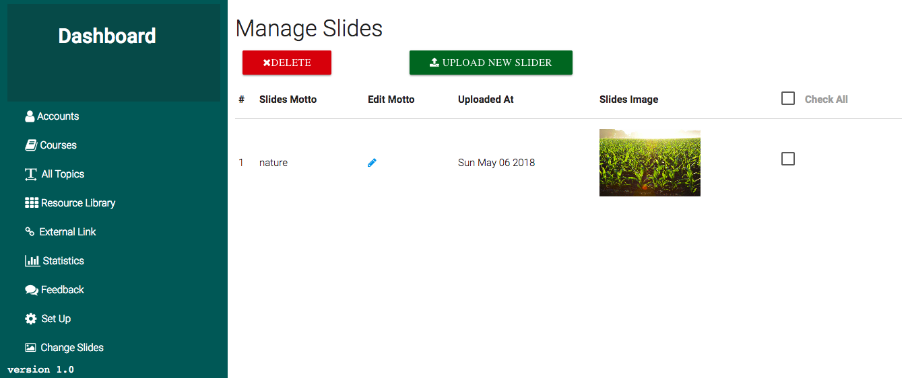

## Home Page Slides  

The Home Page for users has a slide section that shows them different images and these keep changing after few seconds.  

Administrators can upload different images that will be shown, these images can be anything `institution pictures`, `classrooms`, or `any designed graphics` that can contain any `information` that Administrators would want delivered to users(Students).  

The screenshot below shows the page.  

  

Just like other pages for administrators, the slides can be `uploaded` from here, `deleted` and `modified`.  
The uploaded image is shown after, this helps administrators confirm the images immediately after uploading them.  
Note: This page is only **configurable** by a `Super Admin` not content-managers. 

