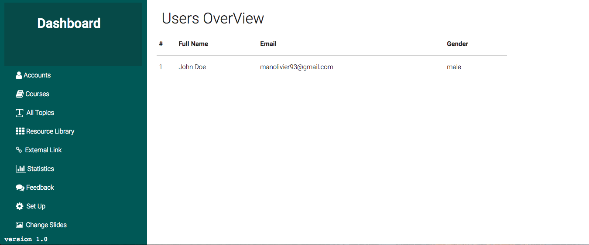
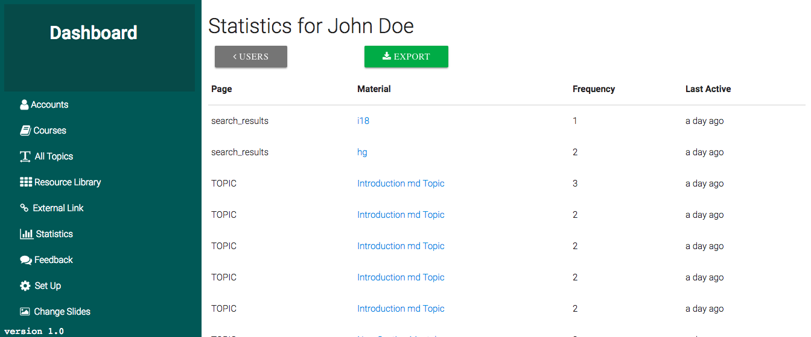

## Student Usage  

The Statistics has 2 pages, The best name would be Usage as this keep tracks of users and their usage, the first page lists all users who have accessed at least the home page.  
This shows the full name, the email and gender.  

  

## Export Usage

The next page which is accessed by clicking on the name of the user list all pages that the user visited, the time they visited that page and how many times that page was visited by the same user.  

The **Export** button allows the Admin to `download` a csv file of a user's usage and view it in an external application like Microsoft excel or Google Sheets. 

  

