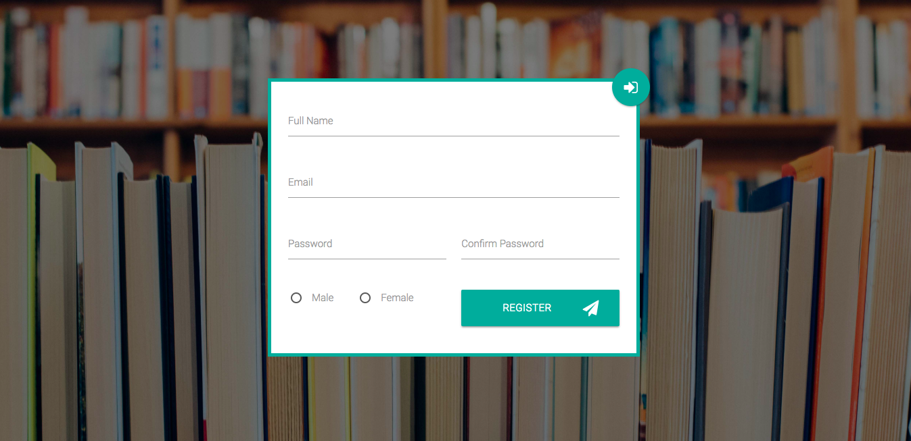

## Introduction

The Platform allows to set User Authentication, this can either be enabled or disabled, this only applies to end-users(Students in most cases)
Administrators and Content-Managers will always need to Create Accounts and Login for them to have access to the platform. 

## Registration 

As mentioned above Whether User Authentication is enabled or disabled, Administrators will always need to register and login before they access SparkEd Dashboard.
The following is a screenshot of the register Page.  

  

## Login 

After Creating Account, The button in the top right can be clicked to change either from login or register page, on the login page you enter the credentials 

  

